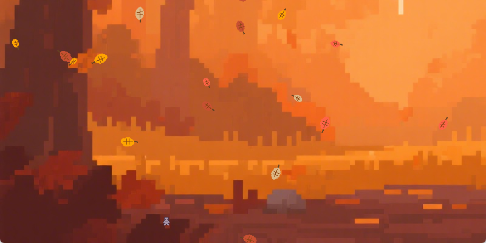

# Autumn Walk (秋日散步)

一个使用 Pygame 制作的简单秋日散步游戏。在这个宁静的秋日场景中，你可以控制一个角色在飘落的树叶中漫步。



## 功能特点

- **角色控制**: 使用 A/D 键控制角色左右移动
- **动画系统**: 角色具有完整的行走动画
- **环境音效**: 移动时会播放脚步声
- **秋日氛围**: 飘落的彩色树叶营造秋日氛围
- **交互元素**: 按空格键可以"捡起"落叶（纯氛围交互）

## 安装与运行

### 环境要求
- uv
- Python 3.11 或更高版本
- pygame >= 2.6.1

### 安装步骤

1. 克隆或下载本项目
2. 进入项目目录
3. 安装依赖：
   ```bash
   uv sync
   ```

### 运行游戏

```bash
uv run autumn-walk
```


## 操作说明

- **A 键**: 向左移动
- **D 键**: 向右移动
- **空格键**: 捡起落叶（氛围交互）
- **关闭窗口**: 退出游戏

## 项目结构

```
autumn_walk/
├── asset/                 # 游戏资源文件
│   └── Prototype_Character/  # 角色图像资源
├── sound/                 # 音效文件
├── src/                   # 源代码
│   └── autumn_walk/       # 主程序包
│       ├── main.py        # 主程序入口
│       ├── character_sprite.py  # 角色精灵类
│       └── leaf_sprite.py       # 落叶精灵类
├── pyproject.toml         # 项目配置文件
└── README.md              # 项目说明文档
```

## 开发说明

### 角色动画系统

角色动画通过 `CharacterSprite` 类实现，支持多种状态的动画帧切换：
- 站立状态
- 向左/向右行走状态

### 落叶系统

落叶通过 `Leaf` 类实现，具有以下特点：
- 随机生成位置
- 不同的颜色（橙色、棕黄色、红色）
- 自然的下落速度
- 超出屏幕后自动清理

## 许可证

本项目采用 MIT 许可证，详情请见 [LICENSE](LICENSE) 文件。